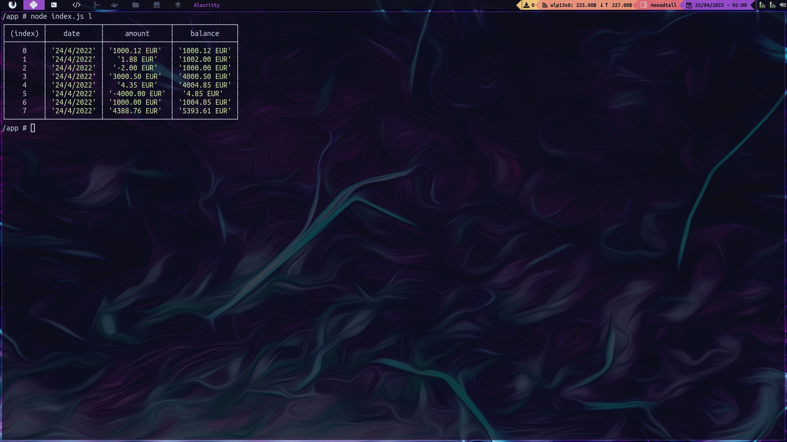

# Bank Account

_CLI app developed with NodeJS to manage your bank account movements._



## Intallation :wrench:

_Following these instructions you could get a working copy of the project on your local machine for development and testing purposes._

### Docker

_Install [Docker](https://docs.docker.com/engine/install/) in your computer._

_On the terminal, pull up app and database container simultaneously._

```
docker compose up -d
```

_On the terminal, run this command to get a the container terminal._

```
docker exec -it bankaccount /bin/sh
```

## How to use it :computer:

_List bank account movements:_

```
node index.js list
```

_Deposit money:_

```
node index.js deposit
```

_Withdraw money:_

```
node index.js withdraw
```

## Built with :pencil:

* [NodeJS](https://nodejs.org/) - Backend
* [MongoDB](https://www.mongodb.com/) - Database

## Author :alien:

* **Manu Valverde** - *Initial work* - [Github](https://github.com/mavalverdecr)

## License :scroll:

This project is under License (MIT) - look this file [LICENSE.md](LICENSE.md) to see more details.

---
⌨️ with ❤️ by [Manu Valverde](https://github.com/mavalverdecr) 😊
